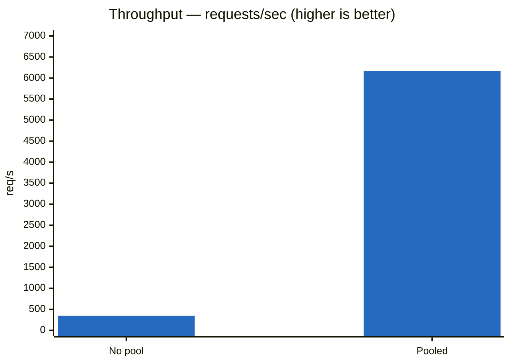
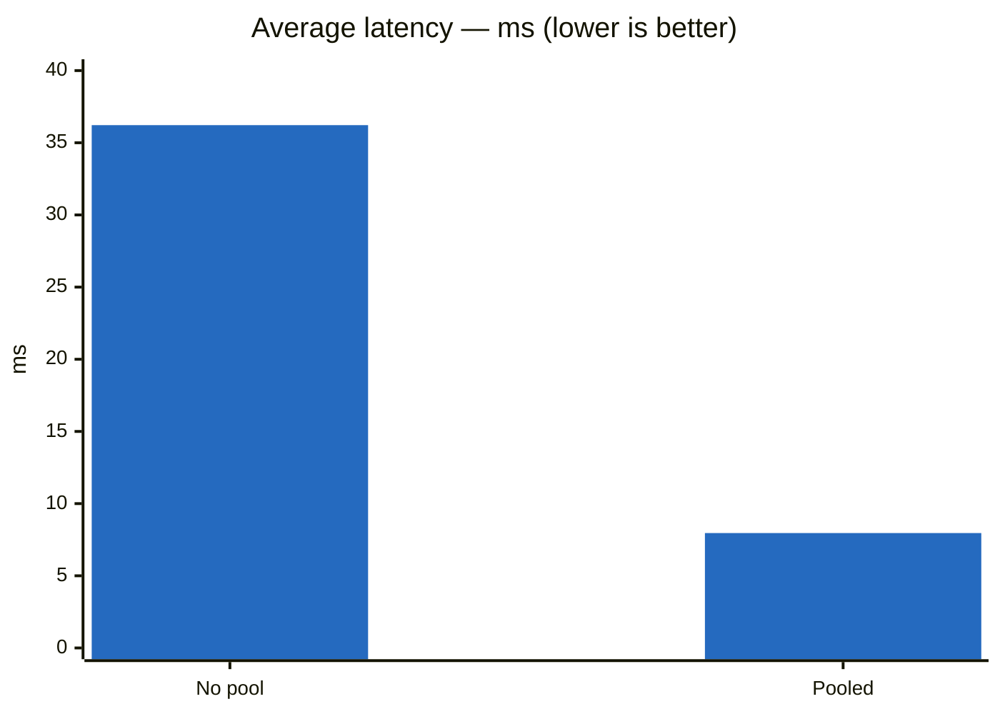
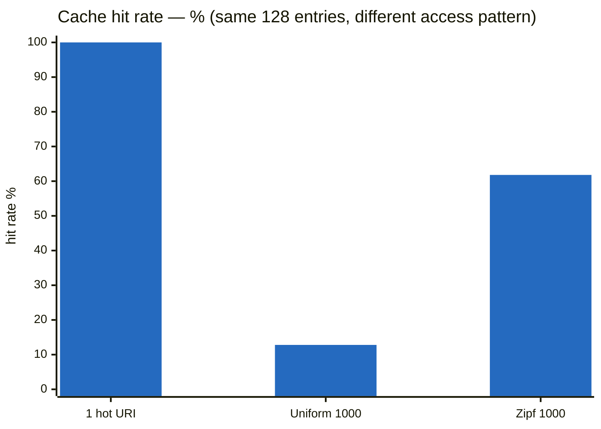
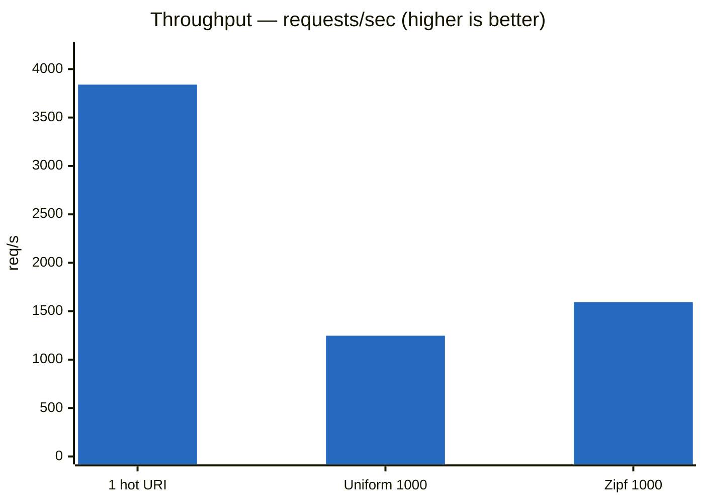
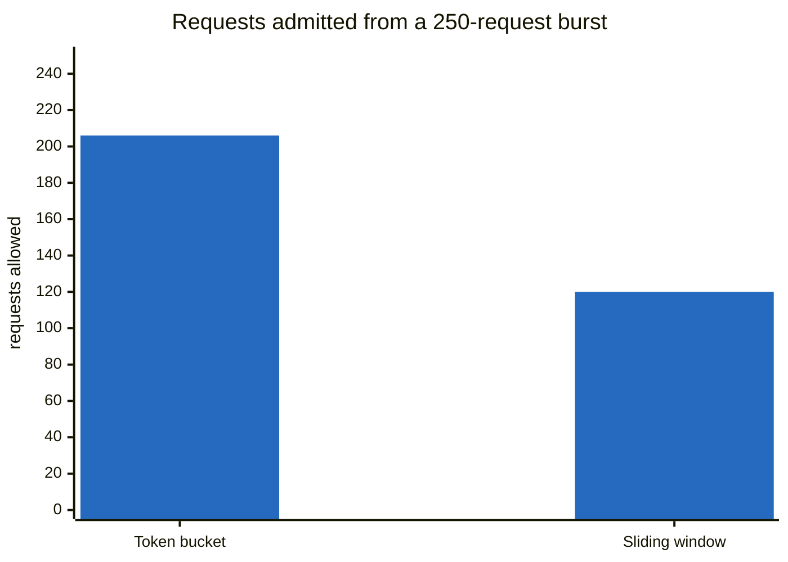

# Java API Gateway

A production-inspired API Gateway built from scratch on **Java + Netty**, following a
12-week roadmap (see [`target.md`](target.md)) to learn networking, non-blocking I/O,
distributed systems, and observability by building rather than reading about them.

## Performance

Measured with [k6](https://k6.io) against two dummy backends, 50 VUs / 30s, back-to-back
on the same machine. Full methodology and raw numbers in [Benchmarking](#benchmarking);
per-run JSON in [`benchmarks/results/`](benchmarks/results).

### Connection pooling was worth 17.8× throughput

64 KB bodies, reusing keep-alive connections instead of opening a TCP connection per request.





| | No pool | Pooled | Change |
|---|---|---|---|
| Throughput | 345.99 rps | **6,166.73 rps** | **17.8× faster** |
| Avg latency | 36.22 ms | **7.96 ms** | 4.5× lower |
| p95 | 24.93 ms | 17.19 ms | 1.5× lower |
| Failed | 0% | 0% | — |

Throughput gained far more than latency because a single request only saves one TCP
handshake, while sustained load without pooling burns ephemeral ports and piles up
`TIME_WAIT` sockets.

### The cache is only as good as the access pattern

1 MB response bodies, 128 MB cache, 5s TTL. Three load patterns against the same cache:

| Metric | 1 hot URI | Uniform, 1000 URIs | Zipf s=1.0, 1000 URIs |
|---|---|---|---|
| **Hit rate** | ~100% (inferred) | **12.8%** | **61.8%** |
| Throughput | 3,839.70 rps | 1,246.99 rps | 1,592.60 rps |
| Data rate | 4,026.79 MB/s | 1,307.75 MB/s | 1,670.20 MB/s |
| Avg latency | 11.96 ms | 38.92 ms | 29.69 ms |
| Median | 8.75 ms | 35.12 ms | 25.02 ms |
| p95 | 32.43 ms | 81.92 ms | 72.94 ms |
| Max | 138.20 ms | 199.03 ms | 209.46 ms |
| Failed | 0% | 0% | 0% |





**Read these three columns as a lesson about benchmarking, not just about caching.**

**Column 1 is a trap.** Hammering one URI means the cache holds a single entry, never
evicts, and answers ~100% of requests from memory — 3,840 rps and 4 GB/s look
spectacular. No production workload behaves like this. Any cache benchmark that reuses
one key is measuring a hash lookup, not a cache.

**Columns 2 and 3 apply real pressure.** 1,000 distinct URIs at 1 MB each is a ~1 GB
working set against a cache holding ~128 entries — 8× oversubscribed, so eviction runs
continuously. Throughput drops ~3× the moment the cache has to make decisions about what
to keep.

**The gap between column 2 and 3 is the whole argument for LRU.** Same cache, same
memory, same keyspace — only the access distribution differs, and the hit rate moves
**4.8×**. Under uniform random access no eviction policy can beat the fraction of the
keyspace it holds: 128/1000 = 12.8%, which is exactly what was measured. There is no
locality to exploit, so LRU, LFU, FIFO and random all perform identically. Zipf gives
LRU something to work with — a hot set that fits — and it keeps it resident.

That number is also the decision criterion for whether an LFU implementation is worth
building: LFU only beats LRU when the hot set is stable over time, and 61.8% is the bar
it would have to clear.

Note that higher hit rate does **not** mean uniformly better latency here — max latency is
slightly *worse* under Zipf (209 ms vs 199 ms). Cache misses still pay two 1 MB copies,
and a burst of them can land together.

### Two rate limiters, same rate, very different behaviour

Both configured for the same sustained rate of **120 requests/min per IP**, then hit with
a burst of 250 requests from one client. This measures *behaviour*, not throughput.



| | Token bucket (200 burst, 2/sec) | Sliding window (120 / 60s) |
|---|---|---|
| Allowed | 206 | **120** |
| Rejected (429) | 44 | 130 |
| Sustained rate | 120/min | 120/min |
| Burst allowance | 200 banked tokens | none |
| State per active IP | 2 fields | 120 boxed timestamps |

**Token bucket banks unused capacity.** 200 tokens were available, so 200 requests passed
instantly — plus ~6 that refilled during the ~3 seconds the burst took. It forgives a
spike, then throttles smoothly.

**Sliding window enforces a hard ceiling.** Never more than 120 in any 60-second stretch,
exact to the request, no burst allowance. Capacity returns in lumps as old timestamps age
out rather than trickling back.

Neither is "better" — bucket suits traffic that is naturally spiky but bounded overall;
window suits a limit you have to be able to state contractually. The cost of the window's
exactness is memory: one timestamp per request in flight, versus two fields.

## Status

Currently through **Week 7** of the roadmap.

| Week | Topic | Status |
|------|-------|--------|
| 1 | Netty Fundamentals (EventLoop, Channel, Pipeline, ByteBuf) | ✅ |
| 2 | Reverse Proxy (forward method/headers/body to a backend) | ✅ |
| 3 | Load Balancer (Round Robin, Least Connections, benchmarking) | ✅ |
| 4 | Health Checks (TCP-level probing, auto add/remove) | ✅ |
| 5 | Connection Pooling (keep-alive reuse, waiter queue, acquire timeout) | ✅ |
| 6 | Response Caching (LRU, byte-budgeted, TTL) | ✅ |
| 7 | Rate Limiting (token bucket + sliding window, per IP) | ✅ |
| 8+ | Resilience, Observability, Dynamic Config, ... | ⬜ |

Path-based routing (Week 10 territory) also landed early, alongside Week 5.

## Architecture

```
Client
   |
Netty HTTP Server (BackendResponseHandler)
   |
   +--> ResponseCache ---- hit? write cached body, done (no backend involved)
   |
   v miss
Router ---- longest-prefix match on URI (/api/movies, /api/todos)
   |
BackendPool --- LoadBalancingStrategy (Round Robin / Least Connections)
   |                     ^
   |                     | filters to healthy only
   v
ConnectionPoolManager --> ConnectionPool (one per Backend)
   |                        borrow an idle keep-alive channel,
   |                        or open one, or queue until timeout
   +---> Backend 1  <-----+
   +---> Backend 2  <-----+---- HealthChecker (TCP probe every 5s)
   +---> ...
```

- **`Main`** — bootstraps the Netty server (`ServerBootstrap`, boss/worker `EventLoopGroup`s),
  wires up the backend lists, `BackendPool`s, `Router`, `ConnectionPoolManager`, the shared
  `ResponseCache`, and `HealthChecker`, and binds to port `1221`.
- **`BackendResponseHandler`** — for each incoming `FullHttpRequest`: checks the cache first
  (GET only) and replies immediately on a hit; otherwise routes to a `BackendPool`, selects a
  backend, borrows a pooled connection, forwards the request (method, URI, headers, body —
  with `X-Forwarded-For` added), relays the response back, stores it in the cache when it is a
  GET/200, and returns the connection to the pool. Returns `404` when no route matches, `503`
  when no healthy backend exists, `504` when the pool acquire times out, and `502` for
  connection, write, or backend failures.

  All cleanup runs through one `finishExchange` path guarded by an `AtomicBoolean`, so a
  connection is returned exactly once no matter which failure fires first.

### `loadbalancer` package

- **`BackendPool`** — holds the set of `Backend`s and a `LoadBalancingStrategy`; on `select()`,
  filters to only healthy backends and delegates the actual pick to the strategy.
- **`LoadBalancingStrategy`** (abstract) — Template Method base class: handles the shared
  empty-pool/no-healthy-backend guard (logs and returns `null`), delegating the real
  algorithm to `doSelect()`.
  - **`RoundRobinStrategy`** — cycles through backends in order.
  - **`LeastConnectionsStrategy`** — picks the backend with the fewest in-flight requests.
- **`Backend`** — wraps a backend's address with an atomic active-connection counter (for
  Least Connections) and a `volatile healthy` flag (for Health Checks).

### `routing` package

- **`Router`** — maps URI prefixes to `BackendPool`s, picking the *longest* matching prefix so
  more specific routes win. Returns `null` when nothing matches, which the handler turns
  into a `404`.

### `pool` package

- **`ConnectionPool`** — one per backend. `acquire()` reuses a live idle channel, discards dead
  ones, opens a new connection while under `maxConnections`, or queues the caller in `waiters`
  and fails it with a `TimeoutException` after `acquireTimeoutMs`. `release()` hands the channel
  straight to a waiting caller if there is one, otherwise parks it as idle.

  All pool state is confined to a single `EventLoop` chosen in the constructor, with both
  methods wrapped in `executor.execute(...)`. That removes the need for locks entirely — the
  same approach Netty's own `FixedChannelPool` takes.
- **`ConnectionPoolManager`** — builds one `ConnectionPool` per `Backend` up front and exposes
  a single `poolFor(backend)` lookup. `Backend` implements `equals`/`hashCode` on its address
  so it works as a map key.

### `cache` package

- **`ResponseCache`** (interface) — the seam is the whole cache rather than a pluggable
  `selectVictim(map)` method, because an O(1) eviction policy is inseparable from the data
  structure backing it. LRU is an access-ordered list; LFU needs frequency buckets. A shared
  "pick a victim" interface could only be implemented by scanning, which is O(n) per eviction.
- **`LruResponseCache`** — a `LinkedHashMap` with `accessOrder = true`, so the head of the list
  is always the least-recently-used entry and `removeEldestEntry` evicts in O(1). Bounded by
  **bytes**, not entry count: with 1 MB responses a million-entry limit would mean 64 GB of
  heap, so `maxBytes` is the meaningful budget. Expiry is lazy — an entry is dropped when
  `get()` touches it — since LRU pressure evicts untouched stale entries anyway.
- **`CachedResponse`** — an immutable record (status, body, headers, expiry). It cannot hold a
  `FullHttpResponse`: those are reference-counted and their buffer is freed once written to the
  client, so the body is stored as a defensively copied `byte[]` and a fresh response is built
  on every hit.

### `health` package

- **`HealthChecker`** — every 5 seconds, attempts a bare TCP connection to each backend
  (no HTTP path/auth involved, to stay agnostic of each backend's own health-endpoint
  quirks). Marks a backend unhealthy on failure and healthy again on recovery, logging
  only on state *transitions* (not every check) to avoid log spam.

## Running

Requires Java 21+ and Maven.

```bash
mvn compile
mvn exec:java -Dexec.mainClass=com.vuhongquang.Main
```

The gateway listens on `localhost:1221`. Backend targets are currently configured directly
in `Main.java` (dynamic configuration is a later roadmap item — Week 10).

```bash
curl localhost:1221/api/movies
```

## Benchmarking

A [k6](https://k6.io) load test lives in `benchmarks/gateway-load-test.js`, and
`benchmarks/dummy_backend.py` is a minimal fixed-response Python server useful for
generating a clean baseline against a uniform backend pool (bypassing real backend
variance).

```bash
k6 run benchmarks/gateway-load-test.js
k6 run -e TARGET_URL=http://localhost:1221/api/movies -e VUS=20 -e DURATION=30s benchmarks/gateway-load-test.js

./benchmarks/stop-all.sh    # kill the gateway and every dummy backend afterwards
```

Each run saves a full-detail JSON summary to `benchmarks/results/<timestamp>.json` for
comparing performance across changes.

### Methodology

All numbers below were measured on the same machine, back-to-back, with only the
gateway build or the load pattern changed:

- **The client-side `sleep(0.1)` was removed.** With it, 50 VUs cannot exceed ~500 rps
  no matter how fast the gateway is — the earlier July runs (~190 rps) were measuring
  the load generator, not the gateway, and are not comparable to anything here.
- **Backends speak HTTP/1.1 keep-alive.** `BaseHTTPRequestHandler` defaults to HTTP/1.0,
  which closes the connection after every response. With no keep-alive there is nothing
  for a connection pool to reuse — the first pooled run failed 28% of requests because
  every borrowed channel was already dead.
- **Gateway logging at WARN.** A per-request `log.info` in the hot path dominates
  throughput otherwise. Cache stats are exempted (`com.vuhongquang.cache` at INFO).
- 50 VUs, 30s, two dummy backends, Least Connections.

### Week 5 — Connection Pooling

64 KB response bodies. `ConnectionPool` versus opening a fresh TCP connection per request.

| Metric | No pool | Pooled | Change |
|---|---|---|---|
| Throughput | 345.99 rps | **6,166.73 rps** | **17.8× faster** |
| Requests (30s) | 20,760 | 185,093 | +791% |
| Avg latency | 36.22 ms | **7.96 ms** | 4.5× lower |
| Median | 11.98 ms | 6.87 ms | 1.7× lower |
| p95 | 24.93 ms | 17.19 ms | 1.5× lower |
| Max | 2,316.02 ms | 1,098.81 ms | 2.1× lower |
| Failed | 0% | 0% | — |

Throughput gained far more than latency did (17.8× vs 4.5×). A single request in
isolation only saves one TCP handshake, which is sub-millisecond on loopback. The real
cost of the unpooled design shows up under *sustained* load: every request consumes an
ephemeral port and leaves a socket in `TIME_WAIT`, so the gateway spends its time
churning connections rather than moving bytes.

Tail latency improved least (p95 only 1.5×) because the pool's `waiters` queue makes a
request wait when all connections are busy, instead of opening its own. That trades a
worse worst case for a much better common case.

### Week 6 — Response Caching

1 MB response bodies, 128 MB cache, 5s TTL. The first column is the naive test — one
permanently-hot URI — and the other two spread requests over 1,000 distinct URIs
(~1 GB working set against a cache holding ~128 entries), so eviction runs constantly.

| Metric | 1 hot URI | Uniform, 1000 URIs | Zipf s=1.0, 1000 URIs |
|---|---|---|---|
| **Hit rate** | ~100% (inferred) | **12.8%** | **61.8%** |
| Throughput | 3,839.70 rps | 1,246.99 rps | 1,592.60 rps |
| Data rate | 4,026.79 MB/s | 1,307.75 MB/s | 1,670.20 MB/s |
| Avg latency | 11.96 ms | 38.92 ms | 29.69 ms |
| Median | 8.75 ms | 35.12 ms | 25.02 ms |
| p95 | 32.43 ms | 81.92 ms | 72.94 ms |
| Max | 138.20 ms | 199.03 ms | 209.46 ms |
| Failed | 0% | 0% | 0% |

**The single-URI number is not a real result.** It never evicts anything. Throughput
drops ~3× once the cache faces genuine pressure, which is what the other two columns
measure.

**Uniform access matches theory exactly**: 128 cached entries / 1,000 keyspace = 12.8%,
and 12.8% is what was measured. Under uniform random access no eviction policy can beat
the fraction of the keyspace it holds — there is no locality to exploit.

**Zipf is where LRU earns its keep**: the same 128 entries deliver 61.8%, a 4.8×
improvement, because skewed access lets LRU keep the hot set resident. That gap is the
argument for LRU over FIFO or random eviction, and it is the number to check before
deciding whether an LFU implementation is worth building.

Cache stats came from `ResponseCache.logStats()`, scheduled every 10s. The cache held
its budget exactly — 128 entries / 134,217,728 bytes on every stats line.

Known cost: every miss copies the body twice, once in `ByteBufUtil.getBytes` and once in
`CachedResponse`'s defensive clone. At a 12.8% hit rate that is ~2 MB of copying per
request.

### Failure behaviour

Killing one of two backends mid-load (30 VUs, 64 KB bodies) exercised every error path:

| Failure | Count | Path |
|---|---|---|
| Connection refused | 29,047 | acquire failure → 502 |
| Backend closed connection | 3 | `channelInactive` → 502 |
| Connection reset | 10 | `exceptionCaught` → 502 |
| Premature channel closure | 2 | `exceptionCaught` → 502 |

The gateway never crashed, hung, or leaked a connection — throughput held at 5,161 rps
and every failure returned a clean 502. **18.76% of requests failed**, all within a
4-second window: the backend died at `15:51:43` and `HealthChecker` only marked it
unhealthy at `15:51:47`, its next 5-second poll. Until then `LeastConnectionsStrategy`
kept handing out a dead backend.

That gap is a design limitation, not a bug: health checking is purely *active*. Marking a
backend unhealthy immediately on connection failure — passive health detection — is what
the Week 8 circuit breaker is for.

## Tech Stack

- Java 21
- Netty 4.2 (`netty-all`)
- Maven
- Logback (SLF4J)
- k6 (benchmarking)

Planned for later weeks: Redis, Prometheus, Grafana, Docker, GitHub Actions.
