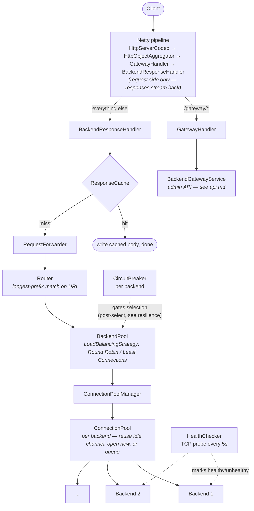

# Architecture

Every `Backend`/`BackendPool`/route/`ConnectionPool` is created at runtime via the
[admin API](api.md) — `Main` boots empty. `GatewayConfig` holds startup constants.
Native Epoll on Linux (`Epoll.isAvailable()`, falls back to NIO) — see
[`performance.md`](performance.md#week-11-83-peak-throughput).

## Root package

| Class | Role |
|---|---|
| `Main` | Builds shared singletons, wires them into `GatewayServer` |
| `GatewayConfig` | Record of startup constants (port, pool limits, cache size, rate limit) |
| `GatewayServer` | Owns `ServerBootstrap` + `EventLoopGroup`s + pipeline lifecycle |
| `BackendResponseHandler` | Client-facing entry point: timer, request counter, rate-limit gate, delegates to `RequestForwarder` |

## `forwarding` package

**`RequestForwarder`** — cache lookup, backend selection, retry, proxy exchange.

| Concern | Design |
|---|---|
| Retry | Up to 3 attempts, `LinkedHashSet<Backend>` exclusion set; oldest exclusion evicted first if pool exhausted |
| Ref-counting | `msg.retain()` once per exchange, released once — not once per attempt |
| Streaming (Week 11) | `ChannelInboundHandlerAdapter` forwards `HttpResponse`/`HttpContent`/`LastHttpContent` as they arrive; cache-accumulator only runs for cacheable responses |
| Request body | Still fully aggregated — retry needs to resend it, can't stream a consumed body |
| Backpressure | `channelWritabilityChanged` on client side toggles `setAutoRead` on backend channel |
| Completed-exchange guard | `channelInactive`/`exceptionCaught` both start with `if (done.get()) return;` |

## `gateway` package

| Class | Role |
|---|---|
| `GatewayHandler` | Path dispatch only: `/gateway/metrics` vs `/gateway/backends*` |
| `BackendGatewayService` | Admin API logic — see [`api.md`](api.md) |
| `gateway.request.*` | Jackson request records; `PatchBackendRequest` uses boxed types so `null` = "field omitted" |

## `loadbalancer` package

| Class | Role |
|---|---|
| `BackendPool` | `CopyOnWriteArrayList<Backend>` + strategy; `select(excluded)` filters healthy + excluded |
| `LoadBalancingStrategy` | Template method; connection-count bookkeeping lives in `select()`, not `doSelect()`. Pool-wide `isAvailable()` pre-filter removed in Week 11 (JFR-measured lock contention) |
| `RoundRobinStrategy` / `LeastConnectionsStrategy` | Both use a rotating `AtomicInteger` start index to avoid tie-starvation |
| `Backend` | Address + swappable `CircuitBreaker` + `AtomicInteger` connections + `volatile healthy`; self-registers its gauges |

## `routing` package

**`Router`** — `ConcurrentHashMap<String, BackendPool>`. `match(uri)` is a plain `for`
loop doing longest-prefix match (converted from `.stream()` in Week 11 — same
complexity, no per-request allocation). `getExact(uri)` for admin API lookups.

## `pool` package

| Class | Role |
|---|---|
| `ConnectionPool` | One per backend; acquire reuses/opens/queues+times-out. All state confined to one `EventLoop` — no locks needed |
| `ConnectionPoolManager` | `ConcurrentHashMap<Backend, ConnectionPool>` |

## `cache` package

| Class | Role |
|---|---|
| `ResponseCache` | Interface — the whole cache is the seam, not just eviction policy (LRU/LFU need different structures) |
| `LruResponseCache` | Access-ordered `LinkedHashMap`, O(1) eviction, bounded by bytes not entries |
| `CachedResponse` | Immutable record with a defensive `byte[]` copy |

## `ratelimit` package

| Class | Role |
|---|---|
| `RateLimiter` | Interface: `Future<Boolean> tryAcquire(key)` |
| `TokenBucketLimiter` / `Bucket` | Active limiter. Lock-free since Week 11 — `AtomicReference<State>` + CAS, was `synchronized` |
| `SlidingWindowLimiter` / `Window` | Still `synchronized` internally, no longer wired as active — superseded rather than rewritten |

## `resilience` package

**`CircuitBreaker`** — rate-based, not consecutive-failure. `CLOSED → OPEN →
HALF_OPEN → CLOSED/OPEN`. Config fields `final`; reconfiguring builds a new instance
via `Backend.setBreaker` (drops in-flight state — see
[`api.md`](api.md#patch-gatewaybackendsid)). Lock-free since Week 11:
`AtomicReference<StateHolder>` + `LongAdder` counters, replacing a `synchronized`
ring buffer — the single largest lock-contention source found by JFR (see
[`performance.md`](performance.md#week-11-83-peak-throughput)).

## `health` package

**`HealthChecker`** — bare TCP connect probe every 5s (no HTTP, stays
endpoint-agnostic). Logs only on state transitions.
