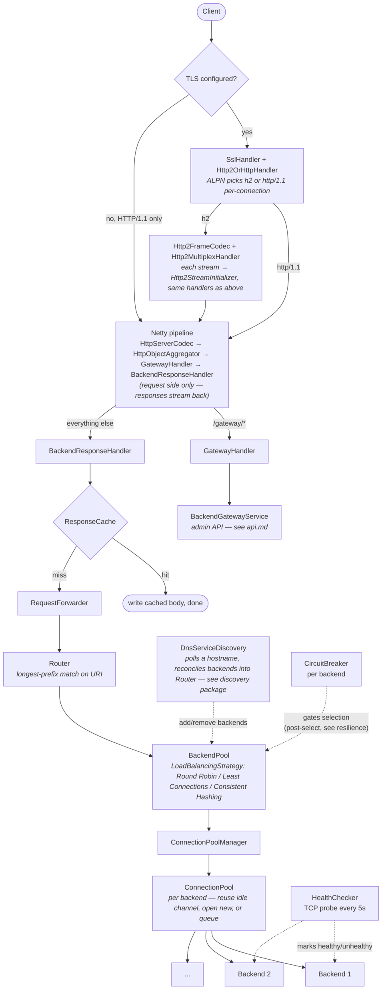

# Architecture

```mermaid
flowchart TD
    Client([Client])
    TLS{TLS configured?}
    ALPN["SslHandler + Http2OrHttpHandler<br/><i>ALPN picks h2 or http/1.1 per-connection</i>"]
    Pipe["Netty pipeline<br/>HttpServerCodec → HttpObjectAggregator → GatewayHandler → BackendResponseHandler<br/><i>(request side only — responses stream back)</i>"]
    Client --> TLS
    TLS -->|yes| ALPN
    TLS -->|no, HTTP/1.1 only| Pipe
    ALPN -->|http/1.1| Pipe
    ALPN -->|h2| H2["Http2FrameCodec + Http2MultiplexHandler<br/><i>each stream → Http2StreamInitializer, same handlers as above</i>"]
    H2 --> Pipe

    Pipe -->|"/gateway/*"| GH[GatewayHandler]
    GH --> BGS["BackendGatewayService<br/><i>admin API — see api.md</i>"]

    Pipe -->|"everything else"| BRH[BackendResponseHandler]
    BRH --> RC{ResponseCache}
    RC -->|hit| Done([write cached body, done])
    RC -->|miss| RF[RequestForwarder]

    RF --> Router["Router<br/><i>longest-prefix match on URI</i>"]
    Router --> BP["BackendPool<br/><i>LoadBalancingStrategy: Round Robin / Least Connections / Consistent Hashing</i>"]

    DNS["DnsServiceDiscovery<br/><i>polls a hostname, reconciles backends into Router — see discovery package</i>"] -.->|add/remove backends| BP

    BP --> CPM[ConnectionPoolManager]
    CPM --> CP1["ConnectionPool<br/><i>per backend — reuse idle channel, open new, or queue</i>"]

    CP1 --> B1[Backend 1]
    CP1 --> B2[Backend 2]
    CP1 --> B3[...]

    CB["CircuitBreaker<br/>per backend"] -.->|"gates selection<br/>(post-select, see resilience)"| BP
    HC["HealthChecker<br/>TCP probe every 5s"] -.->|marks healthy/unhealthy| B1
    HC -.-> B2
```

Every `Backend`/`BackendPool`/route/`ConnectionPool` is created at runtime via the
[admin API](api.md) — `Main` boots empty. `GatewayConfig` holds startup constants.
Native Epoll on Linux (`Epoll.isAvailable()`, falls back to NIO) — see
[`performance.md`](performance.md#week-11-83-peak-throughput).

## Root package

Only the true bootstrap surface lives at root now — the Netty pipeline
handlers moved to their own `pipeline` package (below) so root isn't a catch-all.

| Class | Role |
|---|---|
| `Main` | Builds shared singletons, wires them into `GatewayServer` |
| `GatewayConfig` | Record of startup constants (port, pool limits, cache size + policy, rate limit, TLS cert/key paths, max content length, persist-retry count, virtual-node count) |
| `GatewayServer` | Owns `ServerBootstrap` + `EventLoopGroup`s + pipeline lifecycle. If a TLS cert is configured, prepends an `SslHandler` and `Http2OrHttpHandler`; otherwise wires the HTTP/1.1-only pipeline directly |

## `pipeline` package

| Class | Role |
|---|---|
| `Http2OrHttpHandler` | `ApplicationProtocolNegotiationHandler` — after ALPN completes, builds either the HTTP/2 pipeline (`Http2FrameCodec` + `Http2MultiplexHandler`) or the same HTTP/1.1 chain `GatewayServer` uses without TLS |
| `Http2StreamInitializer` | Per-stream pipeline for HTTP/2 (`Http2MultiplexHandler` creates one virtual `Http2StreamChannel` per stream) — `Http2StreamFrameToHttpObjectCodec` translates HTTP/2 frames into the same `HttpObject`s the HTTP/1.1 path produces, so `GatewayHandler`/`BackendResponseHandler` need no HTTP/2-specific code |
| `HybridRequestAggregator` | Buffers a request body up to `maxContentLength` as before, but switches to streaming straight to the backend if the body exceeds that threshold mid-request, or immediately for routes flagged `forceStream`. A `RateLimitHandler` gates every request (buffered or streamed) before any body work happens, so streamed requests are still rate-limited |
| `BackendResponseHandler` | Client-facing entry point: timer, request counter, rate-limit gate, delegates to `RequestForwarder` |

## `forwarding` package

**`RequestForwarder`** — cache lookup, backend selection, retry, proxy exchange.

| Concern | Design |
|---|---|
| Retry | Up to 3 attempts, `LinkedHashSet<Backend>` exclusion set; oldest exclusion evicted first if pool exhausted |
| Ref-counting | `msg.retain()` once per exchange, released once — not once per attempt |
| Streaming (Week 11) | `ChannelInboundHandlerAdapter` forwards `HttpResponse`/`HttpContent`/`LastHttpContent` as they arrive; cache-accumulator only runs for cacheable responses |
| Request body | Still fully aggregated — retry needs to resend it, can't stream a consumed body |
| Backpressure | `channelWritabilityChanged` on client side toggles `setAutoRead` on backend channel |
| Completed-exchange guard | `channelInactive`/`exceptionCaught` both start with `if (done.get()) return;` |

## `gateway` package

`BackendGatewayService` used to bundle HTTP glue, backend business logic,
persistence, and metrics in one class. Split by responsibility — each piece
below now knows nothing about `ChannelHandlerContext`/`FullHttpRequest` except
`BackendGatewayService` itself:

| Class | Role |
|---|---|
| `GatewayHandler` | Path dispatch only: `/gateway/metrics` vs `/gateway/backends*` vs `/gateway/discovery` |
| `BackendGatewayService` | Pure HTTP glue — parses requests, delegates to the registries/persisters below, writes responses |
| `BackendRegistry` | Backend business logic: register/remove/patch, pool creation. Ctx-free so `DnsServiceDiscovery` can call it directly |
| `DiscoveryRegistry` | Owns the live `discoveries` map and `startDiscovery` lifecycle (creates/starts a `DnsServiceDiscovery`, rejects a duplicate route) |
| `BackendStatePersister` / `DiscoveryStatePersister` | Snapshot build/save/restore for backends and discoveries respectively — retries on save failure (`GatewayConfig.maxRetryPersister`) and counts persistent failures via a Prometheus counter instead of ever failing an already-successful admin request |
| `GatewayStateStore<T>` | Generic snapshot file store (atomic write + retention), parameterized by item type and file prefix — one instance each for backends (`gateway-backends-*.json`) and discoveries (`gateway-discovery-*.json`) |
| `gateway.request.*` | Jackson request records; `PatchBackendRequest` uses boxed types so `null` = "field omitted" |

**State persistence** — each persister's `save()` rebuilds the full current
snapshot from live state (`Router.routes()` for backends, the discovery
registry's own configs for discoveries) and writes it via `GatewayStateStore`
to a new timestamped file (never overwritten — a crash mid-write only
corrupts the newest file, not history), retried up to `maxRetryPersister`
times before giving up and only logging. `GatewayStateStore.save()` writes to
a `.tmp` file then `Files.move(..., ATOMIC_MOVE)`s it into place, and prunes
down to the configured `stateRetentionCount` oldest-first. On boot, `Main`
calls both persisters' `restore()`, which load the newest file and replay
each entry through the same registration path the admin API uses — if the
newest file is corrupt, `load()` falls back to the next-newest, giving
automatic rollback for free. Backend identity in a persisted snapshot is
built from `InetSocketAddress.getHostString()` (literal form, no DNS lookup)
— using `getHostName()` here previously turned a literal `127.0.0.1` into
`localhost` on every restore, silently breaking DELETE/PATCH for that backend.

## `discovery` package

**`DnsServiceDiscovery`** — one instance per route registered via
`POST /gateway/discovery`. On a fixed interval, resolves its configured
hostname (Netty's async `DnsNameResolver`) and reconciles the result against
the route's current backend pool: adds addresses not already present, removes
addresses no longer present, leaves existing backends (and their live
circuit-breaker/health state) completely untouched. Calls straight into
`BackendRegistry`, no HTTP involved.

## `loadbalancer` package

| Class | Role |
|---|---|
| `BackendPool` | `CopyOnWriteArrayList<Backend>` + strategy; `select(excluded, clientIp, uri)` filters healthy + excluded |
| `LoadBalancingStrategy` | Template method; connection-count bookkeeping lives in `select()`, not `doSelect()`. Pool-wide `isAvailable()` pre-filter removed in Week 11 (JFR-measured lock contention). `onBackendAdded`/`onBackendRemoved` are no-op hooks overridden only by `ConsistentHashStrategy` — called from `BackendPool`'s real add/remove, never from a health-check flap |
| `RoundRobinStrategy` / `LeastConnectionsStrategy` | Both use a rotating `AtomicInteger` start index to avoid tie-starvation; ignore `clientIp`/`uri` |
| `ConsistentHashStrategy` | Virtual-node ring (`ConcurrentSkipListMap<Long, Backend>`, ~150 points/backend, MD5-derived keys) — **persistent**, not rebuilt per request, so adding/removing one backend only remaps that backend's share of keys rather than reshuffling everything. Hashes on `clientIp` or `uri` per its `KeyType`, set per route. `doSelect` walks forward past ring entries whose backend isn't in the already-filtered healthy/non-excluded list (bounded by ring size), so an unhealthy or just-excluded backend is skipped, not returned |
| `Backend` | Address + swappable `CircuitBreaker` + `AtomicInteger` connections + `volatile healthy`; self-registers its gauges |
| `StrategyType` | Enum mapping the admin API's `strategy` int ↔ a strategy *factory* (`BiFunction<ConsistentHashStrategy.KeyType, GatewayConfig, LoadBalancingStrategy>` — the two simpler strategies just ignore both arguments), used by both `registerBackend` (id → new instance) and the backend persister (instance's class → id). A factory, not a shared instance — each strategy instance carries its own mutable state (rotation index, or ring), so reusing one across pools would leak state between unrelated routes |

## `routing` package

**`Router`** — `ConcurrentHashMap<String, BackendPool>`. `match(uri)` is a plain `for`
loop doing longest-prefix match (converted from `.stream()` in Week 11 — same
complexity, no per-request allocation). `getExact(uri)` for admin API lookups.

## `pool` package

| Class | Role |
|---|---|
| `ConnectionPool` | One per backend; acquire reuses/opens/queues+times-out. All state confined to one `EventLoop` — no locks needed |
| `ConnectionPoolManager` | `ConcurrentHashMap<Backend, ConnectionPool>` |

## `cache` package

| Class | Role |
|---|---|
| `ResponseCache` | Interface — response-cache-specific (TTL, hits/misses, `maxBytes()`) |
| `StripedResponseCache` | The one `ResponseCache` implementation. Adapts the generic `StripedCache<CachedResponse>` below: handles TTL expiry (proactively evicting an expired-but-polled key via `remove()`, not just discarding it), and handles `maxBytes=0` ("cache disabled") entirely itself rather than relying on callers to gate it |
| `CachedResponse` | Immutable record with a defensive `byte[]` copy |

## `cache.striped` package

Generic, response-cache-agnostic — reusable for any future bounded cache, not just HTTP responses.

| Class | Role |
|---|---|
| `StripedCache<V>` | N independent `EvictionStore<V>` instances, each behind its own `ReentrantLock`, sharing one global `AtomicLong` byte-budget. Key → stripe via a spread hash (XORs high bits down before `floorMod`, so a power-of-2 stripe count doesn't collapse to low-bits-only distribution). Eviction on `put()` only walks the stripe that just grew — so LRU/LFU is per-stripe/approximate, not exactly global, in exchange for real concurrency. `get`/`put`/`remove` all fail safe (log + no-op) rather than propagating an internal error to the caller |
| `EvictionStore<V>` | Pluggable per-stripe eviction-policy contract: `get`/`put`/`evictOne`/`remove`/`size`/`clear` |
| `LruStore<V>` | Access-ordered `LinkedHashMap` |
| `LfuStore<V>` | Classic O(1) LFU — frequency buckets in a `TreeMap<Integer, LinkedHashSet<String>>` (so the post-eviction minimum-frequency lookup never has to guess at a gap), plus `key→value`/`key→freq` hash maps |

## `ratelimit` package

| Class | Role |
|---|---|
| `RateLimiter` | Interface: `Future<Boolean> tryAcquire(key)` |
| `TokenBucketLimiter` / `Bucket` | Active limiter. Lock-free since Week 11 — `AtomicReference<State>` + CAS, was `synchronized` |
| `SlidingWindowLimiter` / `Window` | Still `synchronized` internally, no longer wired as active — superseded rather than rewritten |

## `resilience` package

**`CircuitBreaker`** — rate-based, not consecutive-failure. `CLOSED → OPEN →
HALF_OPEN → CLOSED/OPEN`. Config fields `final`; reconfiguring builds a new instance
via `Backend.setBreaker` (drops in-flight state — see
[`api.md`](api.md#patch-gatewaybackendsid)). Lock-free since Week 11:
`AtomicReference<StateHolder>` + `LongAdder` counters, replacing a `synchronized`
ring buffer — the single largest lock-contention source found by JFR (see
[`performance.md`](performance.md#week-11-83-peak-throughput)).

## `health` package

**`HealthChecker`** — bare TCP connect probe every 5s (no HTTP, stays
endpoint-agnostic). Logs only on state transitions.
