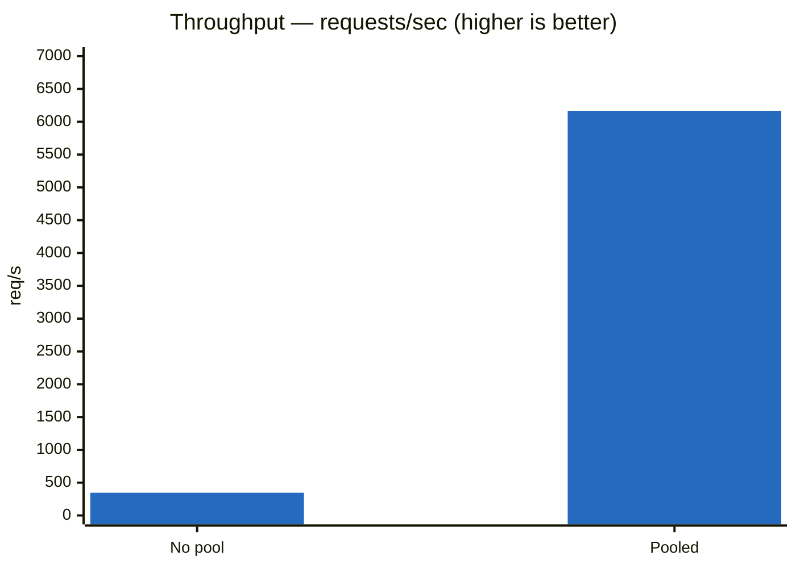
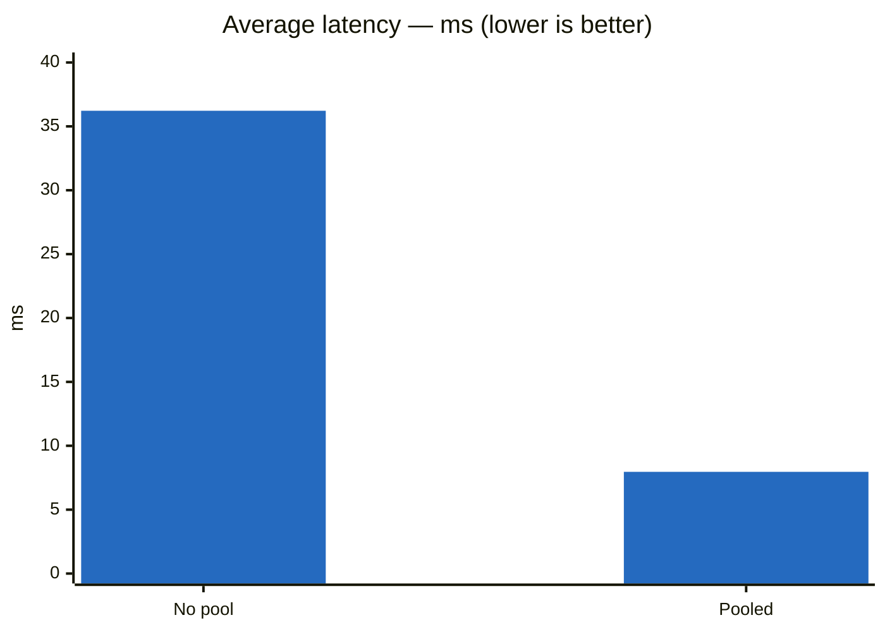
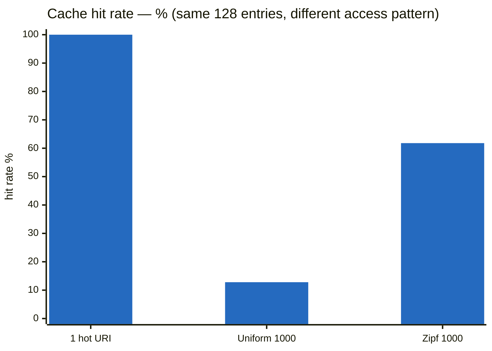
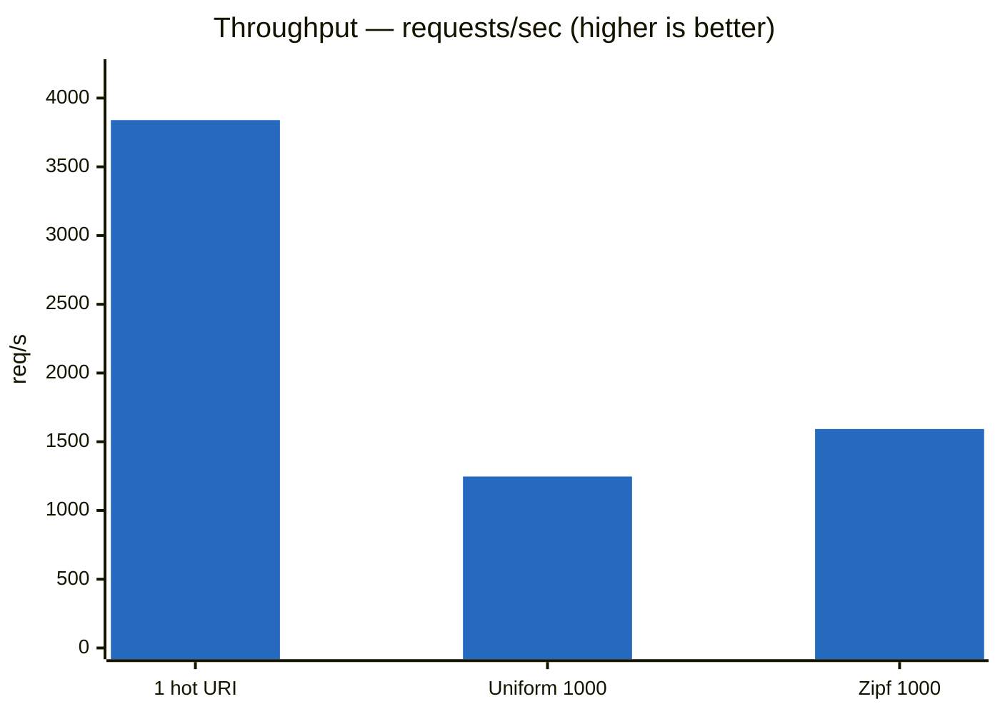
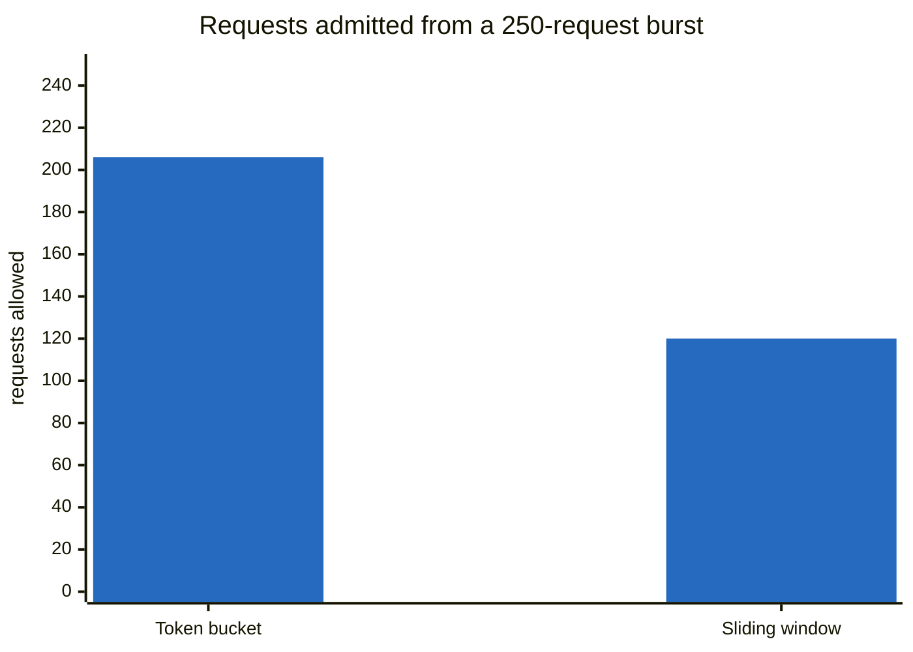

# Performance

Measured with [k6](https://k6.io) against dummy backends, 50 VUs / 30s, back-to-back on
the same machine. Per-run JSON in [`benchmarks/results/`](../benchmarks/results).

## Connection pooling was worth 17.8× throughput

64 KB bodies, reusing keep-alive connections instead of opening a TCP connection per
request.





| | No pool | Pooled | Change |
|---|---|---|---|
| Throughput | 345.99 rps | **6,166.73 rps** | **17.8× faster** |
| Requests (30s) | 20,760 | 185,093 | +791% |
| Avg latency | 36.22 ms | **7.96 ms** | 4.5× lower |
| Median | 11.98 ms | 6.87 ms | 1.7× lower |
| p95 | 24.93 ms | 17.19 ms | 1.5× lower |
| Max | 2,316.02 ms | 1,098.81 ms | 2.1× lower |
| Failed | 0% | 0% | — |

Throughput gained far more than latency because a single request only saves one TCP
handshake, while sustained load without pooling burns ephemeral ports and piles up
`TIME_WAIT` sockets. Tail latency improved least (p95 only 1.5×) because the pool's
`waiters` queue makes a request wait when all connections are busy, instead of opening
its own — trading a worse worst case for a much better common case.

## The cache is only as good as the access pattern

1 MB response bodies, 128 MB cache, 5s TTL. Three load patterns against the same cache:

| Metric | 1 hot URI | Uniform, 1000 URIs | Zipf s=1.0, 1000 URIs |
|---|---|---|---|
| **Hit rate** | ~100% (inferred) | **12.8%** | **61.8%** |
| Throughput | 3,839.70 rps | 1,246.99 rps | 1,592.60 rps |
| Data rate | 4,026.79 MB/s | 1,307.75 MB/s | 1,670.20 MB/s |
| Avg latency | 11.96 ms | 38.92 ms | 29.69 ms |
| Median | 8.75 ms | 35.12 ms | 25.02 ms |
| p95 | 32.43 ms | 81.92 ms | 72.94 ms |
| Max | 138.20 ms | 199.03 ms | 209.46 ms |
| Failed | 0% | 0% | 0% |





**Read these three columns as a lesson about benchmarking, not just about caching.**

**Column 1 is a trap.** Hammering one URI means the cache holds a single entry, never
evicts, and answers ~100% of requests from memory — 3,840 rps and 4 GB/s look
spectacular. No production workload behaves like this. Any cache benchmark that reuses
one key is measuring a hash lookup, not a cache.

**Columns 2 and 3 apply real pressure.** 1,000 distinct URIs at 1 MB each is a ~1 GB
working set against a cache holding ~128 entries — 8× oversubscribed, so eviction runs
continuously. Throughput drops ~3× the moment the cache has to make decisions about what
to keep.

**The gap between column 2 and 3 is the whole argument for LRU.** Same cache, same
memory, same keyspace — only the access distribution differs, and the hit rate moves
**4.8×**. Under uniform random access no eviction policy can beat the fraction of the
keyspace it holds: 128/1000 = 12.8%, which is exactly what was measured. There is no
locality to exploit, so LRU, LFU, FIFO and random all perform identically. Zipf gives LRU
something to work with — a hot set that fits — and it keeps it resident.

That number is also the decision criterion for whether an LFU implementation is worth
building: LFU only beats LRU when the hot set is stable over time, and 61.8% is the bar
it would have to clear.

Note that higher hit rate does **not** mean uniformly better latency here — max latency
is slightly *worse* under Zipf (209 ms vs 199 ms). Cache misses still pay two 1 MB
copies, and a burst of them can land together.

Cache stats came from `ResponseCache.logStats()`, scheduled every 10s. The cache held
its budget exactly — 128 entries / 134,217,728 bytes on every stats line. Known cost:
every miss copies the body twice, once in `ByteBufUtil.getBytes` and once in
`CachedResponse`'s defensive clone — at a 12.8% hit rate that's ~2 MB of copying per
request.

## Two rate limiters, same rate, very different behaviour

Both configured for the same sustained rate of **120 requests/min per IP**, then hit with
a burst of 250 requests from one client. This measures *behaviour*, not throughput.



| | Token bucket (200 burst, 2/sec) | Sliding window (120 / 60s) |
|---|---|---|
| Allowed | 206 | **120** |
| Rejected (429) | 44 | 130 |
| Sustained rate | 120/min | 120/min |
| Burst allowance | 200 banked tokens | none |
| State per active IP | 2 fields | 120 boxed timestamps |

**Token bucket banks unused capacity.** 200 tokens were available, so 200 requests passed
instantly — plus ~6 that refilled during the ~3 seconds the burst took. It forgives a
spike, then throttles smoothly.

**Sliding window enforces a hard ceiling.** Never more than 120 in any 60-second stretch,
exact to the request, no burst allowance. Capacity returns in lumps as old timestamps age
out rather than trickling back.

Neither is "better" — bucket suits traffic that is naturally spiky but bounded overall;
window suits a limit you have to be able to state contractually. The cost of the
window's exactness is memory: one timestamp per request in flight, versus two fields.

## Failure behaviour

Killing one of two backends mid-load (30 VUs, 64 KB bodies) exercised every error path:

| Failure | Count | Path |
|---|---|---|
| Connection refused | 29,047 | acquire failure → 502 |
| Backend closed connection | 3 | `channelInactive` → 502 |
| Connection reset | 10 | `exceptionCaught` → 502 |
| Premature channel closure | 2 | `exceptionCaught` → 502 |

The gateway never crashed, hung, or leaked a connection — throughput held at 5,161 rps
and every failure returned a clean 502. **18.76% of requests failed**, all within a
4-second window: the backend died at `15:51:43` and `HealthChecker` only marked it
unhealthy at `15:51:47`, its next 5-second poll. Until then `LeastConnectionsStrategy`
kept handing out a dead backend.

That gap was a design limitation at the time — purely *active* health checking. It's
what the Week 8 retry + circuit breaker (see [`architecture.md`](architecture.md)) closes:
a connect-time failure now retries against a different backend within the same exchange,
and enough failures within a window trips that backend's circuit breaker independent of
the 5-second health-check cadence.

## Methodology

- **The client-side `sleep(0.1)` was removed.** With it, 50 VUs cannot exceed ~500 rps no
  matter how fast the gateway is — the earliest baseline runs (~190 rps) were measuring
  the load generator, not the gateway, and are not comparable to anything above.
- **Backends speak HTTP/1.1 keep-alive.** `BaseHTTPRequestHandler` defaults to HTTP/1.0,
  which closes the connection after every response. With no keep-alive there is nothing
  for a connection pool to reuse — the first pooled run failed 28% of requests because
  every borrowed channel was already dead.
- **Gateway logging at WARN.** A per-request `log.info` in the hot path dominates
  throughput otherwise. Cache stats are exempted (`com.vuhongquang.cache` at INFO).
- 50 VUs, 30s, two dummy backends, Least Connections, unless noted otherwise per section.

## Running the benchmarks

```bash
k6 run benchmarks/gateway-load-test.js
k6 run -e TARGET_URL=http://localhost:1221/api/movies -e VUS=20 -e DURATION=30s benchmarks/gateway-load-test.js

./benchmarks/stop-all.sh    # kill the gateway and every dummy backend afterwards
```

Each run saves a full-detail JSON summary to `benchmarks/results/<timestamp>.json` for
comparing performance across changes. `benchmarks/dummy_backend.py` is a minimal
fixed-response Python server useful for generating a clean baseline against a uniform
backend pool (bypassing real backend variance).
