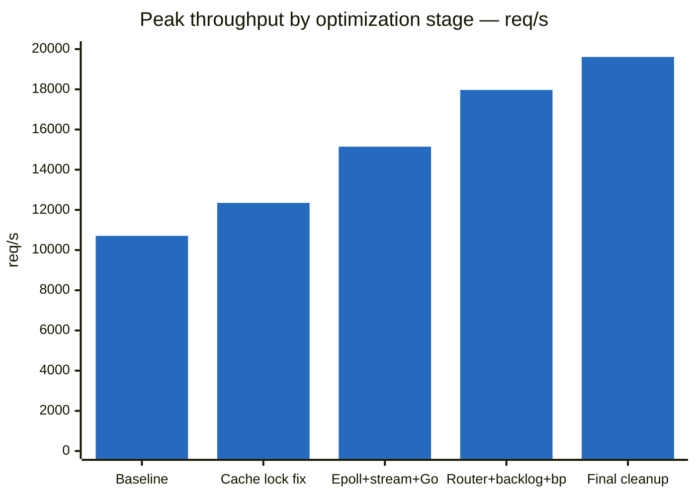
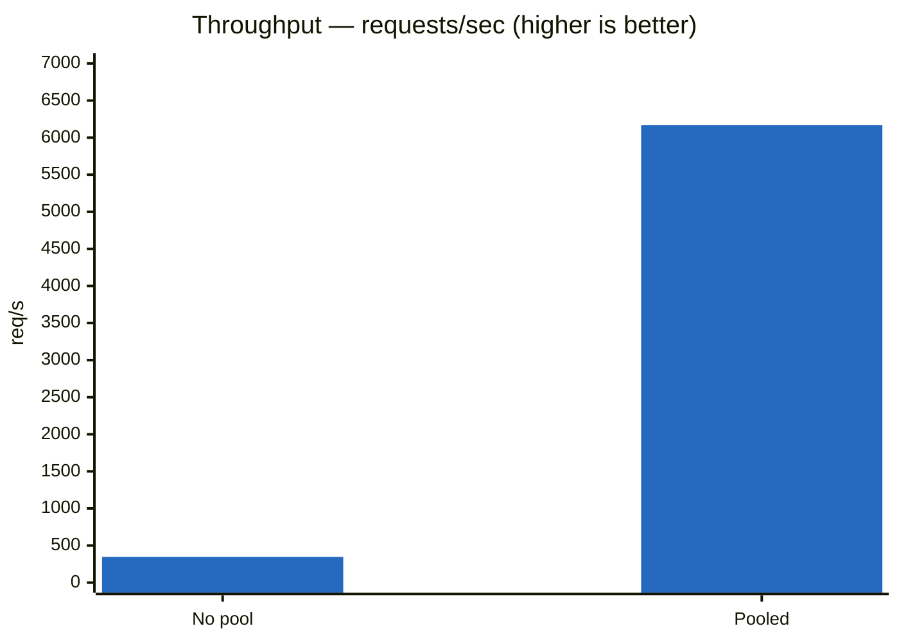
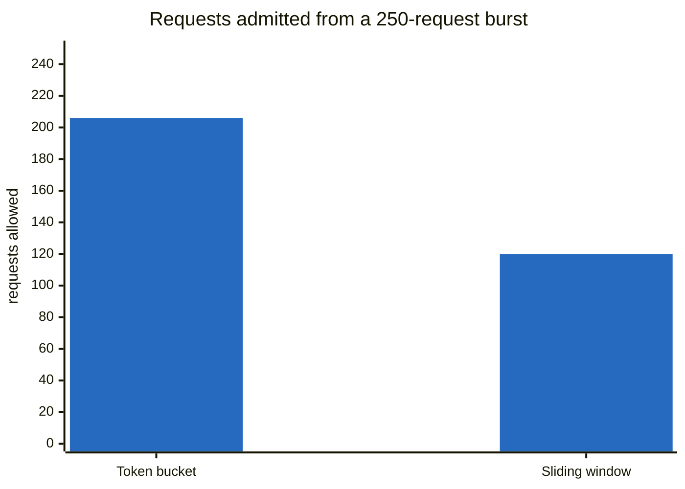

# Performance

Measured with [k6](https://k6.io) against dummy backends, 50 VUs / 30s, back-to-back on
the same machine. Per-run JSON in [`benchmarks/results/`](../benchmarks/results).

## Week 11: +83% peak throughput

Plateau at **10,700 rps** (8 vs 16 cores made no difference) → JFR found 3 hot-path locks.



| Stage | Peak rps |
|---|---|
| Baseline | 10,708 |
| + cache lock fix | 12,349 |
| + Epoll + streaming + Go backend + core isolation | 15,146 |
| + Router loop + `SO_BACKLOG` + thread sizing + backpressure | 17,968 |
| + stream/metric/header allocation cleanup | **19,610** |

**Locks removed:**

| Class | Fix |
|---|---|
| `LruResponseCache` | Skip cache read/write when `cacheMaxBytes == 0` |
| `TokenBucketLimiter.Bucket` | `synchronized` → `AtomicReference<State>` + CAS |
| `CircuitBreaker` | Dropped pool-wide `isAvailable()` pre-filter; `AtomicReference<StateHolder>` + `LongAdder` |

`JavaMonitorEnter` events: 626 → 469 → 186 → **6**. Locks-only gain: 10,708 → 12,349 rps.

**Transport & I/O:**

| Change | Effect |
|---|---|
| Native Epoll | VUS=50: 14,396 rps vs NIO's 1,277 rps; peak ceiling +4-5% |
| Response streaming (no aggregator) | 10MB payload scales with bytes instead of collapsing |
| Backpressure (`setAutoRead(false)`) | Prevents OOM when client drains slower than backend |
| `SO_BACKLOG=1024`, `boss` fixed at 2 threads | Removes implicit platform defaults |

Request bodies are **not** streamed (retry needs to resend the original body).

**Benchmark infra fixes:**

- Python dummy backend's backlog-of-5 caused false connection resets → rewritten in Go
- Client/gateway/backend colocated on one machine → fixed with `taskset` core isolation
- `Router.match()` stream → for-loop

JFR-verified zero lock contention, zero errors/leaks. Run-to-run swing on this VM:
~16,000–19,610 rps (JIT/GC noise) — treat any single number as a sample. Next lever is
horizontal scaling, not more single-instance tuning. Full notes:
[`benchmarks/results/week11-rps-ceiling-notes.md`](../benchmarks/results/week11-rps-ceiling-notes.md).

## Connection pooling: 17.8× throughput

64 KB bodies, reusing keep-alive connections instead of opening a TCP connection per
request.



| | No pool | Pooled | Change |
|---|---|---|---|
| Throughput | 345.99 rps | **6,166.73 rps** | **17.8× faster** |
| Avg latency | 36.22 ms | **7.96 ms** | 4.5× lower |
| p95 | 24.93 ms | 17.19 ms | 1.5× lower |
| Failed | 0% | 0% | — |

Throughput gains more than latency because sustained load without pooling burns
ephemeral ports and piles up `TIME_WAIT` sockets, not just one saved handshake.

## Cache: hit rate depends entirely on access pattern

1 MB bodies, 128 MB cache (128 entries), 5s TTL.


| Metric | 1 hot URI | Uniform, 1000 URIs | Zipf s=1.0, 1000 URIs |
|---|---|---|---|
| Hit rate | ~100% | **12.8%** | **61.8%** |
| Throughput | 3,839.70 rps | 1,246.99 rps | 1,592.60 rps |
| Failed | 0% | 0% | 0% |

**1 hot URI is a trap** — a single cached key hides eviction entirely, not a realistic test.
**Uniform vs Zipf is the real result**: same cache, same memory, only the access
distribution differs — hit rate moves **4.8×** because LRU has a hot set to exploit under
Zipf but none under uniform random access (128/1000 = 12.8% is the theoretical floor).

## Rate limiting: same rate, different burst behaviour

Both configured for **120 req/min per IP**, hit with a burst of 250 requests.



| | Token bucket (200 burst, 2/sec) | Sliding window (120 / 60s) |
|---|---|---|
| Allowed | 206 | **120** |
| Sustained rate | 120/min | 120/min |
| Burst allowance | 200 banked tokens | none (hard ceiling) |
| State per active IP | 2 fields | 120 boxed timestamps |

Bucket forgives spikes then throttles smoothly; window enforces an exact contractual
ceiling at the cost of per-request memory.

## Failure behaviour

Killing one of two backends mid-load (30 VUs, 64 KB bodies):

| Failure | Count | Path |
|---|---|---|
| Connection refused | 29,047 | acquire failure → 502 |
| Backend closed connection | 3 | `channelInactive` → 502 |
| Connection reset | 10 | `exceptionCaught` → 502 |
| Premature channel closure | 2 | `exceptionCaught` → 502 |

**18.76% of requests failed**, all within the 4s gap between backend death and the next
`HealthChecker` poll — closed by the Week 8 retry + circuit breaker (see
[`architecture.md`](architecture.md)), which reacts within the same exchange instead of
waiting for the next 5s health-check cycle. Zero crashes, hangs, or leaked connections.

## Methodology

- Client-side `sleep(0.1)` removed — with it, 50 VUs caps at ~500 rps regardless of gateway speed
- Backends use HTTP/1.1 keep-alive (`BaseHTTPRequestHandler` defaults to 1.0, breaking pooling)
- Gateway logging at WARN (per-request `log.info` dominates the hot path otherwise)
- 50 VUs, 30s, two dummy backends, Least Connections, unless noted per section

## Running the benchmarks

```bash
k6 run benchmarks/gateway-load-test.js
k6 run -e TARGET_URL=http://localhost:1221/api/movies -e VUS=20 -e DURATION=30s benchmarks/gateway-load-test.js

./benchmarks/stop-all.sh    # kill the gateway and every dummy backend afterwards
```

Each run saves a full-detail JSON summary to `benchmarks/results/<timestamp>.json`.
`benchmarks/dummy_backend.go` is a static Go binary (`CGO_ENABLED=0 go build`, no Go
runtime needed on the target machine) — replaced an earlier Python version whose
listen backlog of 5 reset connections under concurrent load (see Week 11 above).
