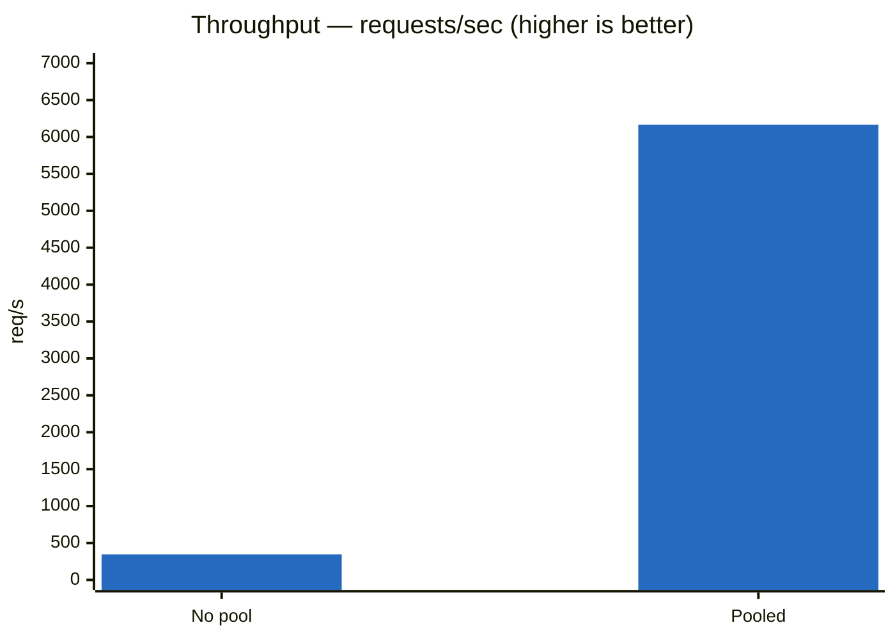
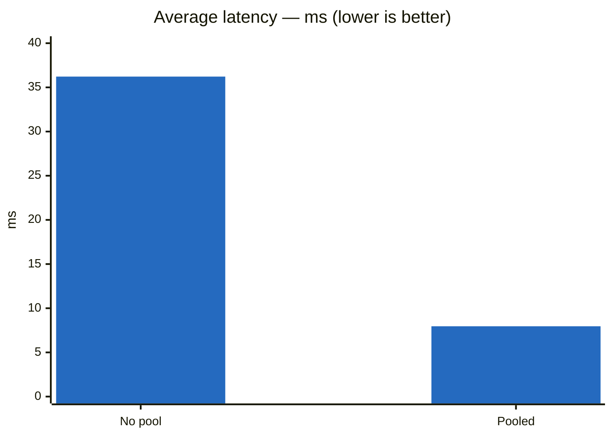
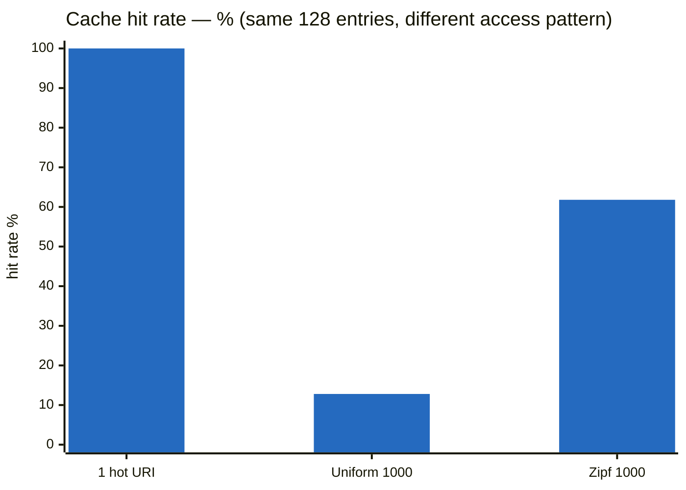
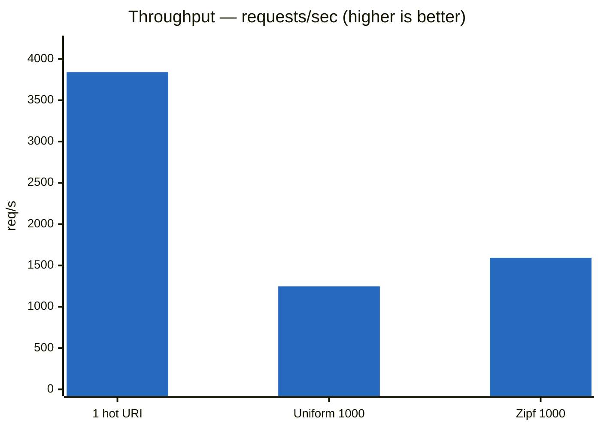
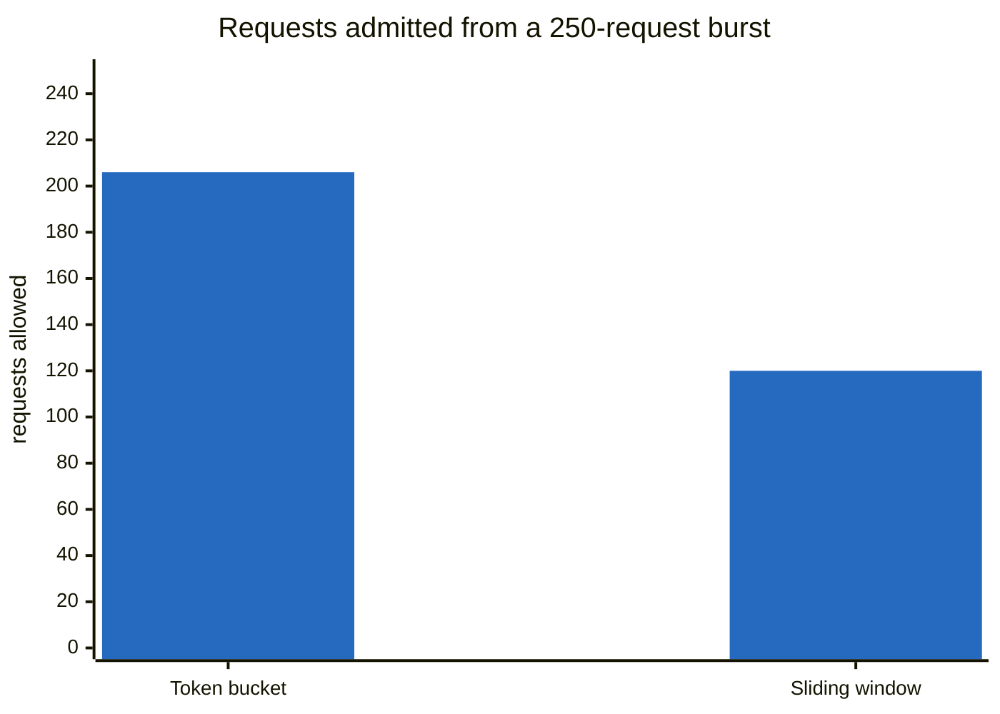

# Performance

Measured with [k6](https://k6.io) against dummy backends, 50 VUs / 30s, back-to-back on
the same machine. Per-run JSON in [`benchmarks/results/`](../benchmarks/results).

## Connection pooling was worth 17.8× throughput

64 KB bodies, reusing keep-alive connections instead of opening a TCP connection per
request.





| | No pool | Pooled | Change |
|---|---|---|---|
| Throughput | 345.99 rps | **6,166.73 rps** | **17.8× faster** |
| Requests (30s) | 20,760 | 185,093 | +791% |
| Avg latency | 36.22 ms | **7.96 ms** | 4.5× lower |
| Median | 11.98 ms | 6.87 ms | 1.7× lower |
| p95 | 24.93 ms | 17.19 ms | 1.5× lower |
| Max | 2,316.02 ms | 1,098.81 ms | 2.1× lower |
| Failed | 0% | 0% | — |

Throughput gained far more than latency because a single request only saves one TCP
handshake, while sustained load without pooling burns ephemeral ports and piles up
`TIME_WAIT` sockets. Tail latency improved least (p95 only 1.5×) because the pool's
`waiters` queue makes a request wait when all connections are busy, instead of opening
its own — trading a worse worst case for a much better common case.

## The cache is only as good as the access pattern

1 MB response bodies, 128 MB cache, 5s TTL. Three load patterns against the same cache:

| Metric | 1 hot URI | Uniform, 1000 URIs | Zipf s=1.0, 1000 URIs |
|---|---|---|---|
| **Hit rate** | ~100% (inferred) | **12.8%** | **61.8%** |
| Throughput | 3,839.70 rps | 1,246.99 rps | 1,592.60 rps |
| Data rate | 4,026.79 MB/s | 1,307.75 MB/s | 1,670.20 MB/s |
| Avg latency | 11.96 ms | 38.92 ms | 29.69 ms |
| Median | 8.75 ms | 35.12 ms | 25.02 ms |
| p95 | 32.43 ms | 81.92 ms | 72.94 ms |
| Max | 138.20 ms | 199.03 ms | 209.46 ms |
| Failed | 0% | 0% | 0% |





**Read these three columns as a lesson about benchmarking, not just about caching.**

**Column 1 is a trap.** Hammering one URI means the cache holds a single entry, never
evicts, and answers ~100% of requests from memory — 3,840 rps and 4 GB/s look
spectacular. No production workload behaves like this. Any cache benchmark that reuses
one key is measuring a hash lookup, not a cache.

**Columns 2 and 3 apply real pressure.** 1,000 distinct URIs at 1 MB each is a ~1 GB
working set against a cache holding ~128 entries — 8× oversubscribed, so eviction runs
continuously. Throughput drops ~3× the moment the cache has to make decisions about what
to keep.

**The gap between column 2 and 3 is the whole argument for LRU.** Same cache, same
memory, same keyspace — only the access distribution differs, and the hit rate moves
**4.8×**. Under uniform random access no eviction policy can beat the fraction of the
keyspace it holds: 128/1000 = 12.8%, which is exactly what was measured. There is no
locality to exploit, so LRU, LFU, FIFO and random all perform identically. Zipf gives LRU
something to work with — a hot set that fits — and it keeps it resident.

That number is also the decision criterion for whether an LFU implementation is worth
building: LFU only beats LRU when the hot set is stable over time, and 61.8% is the bar
it would have to clear.

Note that higher hit rate does **not** mean uniformly better latency here — max latency
is slightly *worse* under Zipf (209 ms vs 199 ms). Cache misses still pay two 1 MB
copies, and a burst of them can land together.

Cache stats came from `ResponseCache.logStats()`, scheduled every 10s. The cache held
its budget exactly — 128 entries / 134,217,728 bytes on every stats line. Known cost:
every miss copies the body twice, once in `ByteBufUtil.getBytes` and once in
`CachedResponse`'s defensive clone — at a 12.8% hit rate that's ~2 MB of copying per
request.

## Two rate limiters, same rate, very different behaviour

Both configured for the same sustained rate of **120 requests/min per IP**, then hit with
a burst of 250 requests from one client. This measures *behaviour*, not throughput.



| | Token bucket (200 burst, 2/sec) | Sliding window (120 / 60s) |
|---|---|---|
| Allowed | 206 | **120** |
| Rejected (429) | 44 | 130 |
| Sustained rate | 120/min | 120/min |
| Burst allowance | 200 banked tokens | none |
| State per active IP | 2 fields | 120 boxed timestamps |

**Token bucket banks unused capacity.** 200 tokens were available, so 200 requests passed
instantly — plus ~6 that refilled during the ~3 seconds the burst took. It forgives a
spike, then throttles smoothly.

**Sliding window enforces a hard ceiling.** Never more than 120 in any 60-second stretch,
exact to the request, no burst allowance. Capacity returns in lumps as old timestamps age
out rather than trickling back.

Neither is "better" — bucket suits traffic that is naturally spiky but bounded overall;
window suits a limit you have to be able to state contractually. The cost of the
window's exactness is memory: one timestamp per request in flight, versus two fields.

## Failure behaviour

Killing one of two backends mid-load (30 VUs, 64 KB bodies) exercised every error path:

| Failure | Count | Path |
|---|---|---|
| Connection refused | 29,047 | acquire failure → 502 |
| Backend closed connection | 3 | `channelInactive` → 502 |
| Connection reset | 10 | `exceptionCaught` → 502 |
| Premature channel closure | 2 | `exceptionCaught` → 502 |

The gateway never crashed, hung, or leaked a connection — throughput held at 5,161 rps
and every failure returned a clean 502. **18.76% of requests failed**, all within a
4-second window: the backend died at `15:51:43` and `HealthChecker` only marked it
unhealthy at `15:51:47`, its next 5-second poll. Until then `LeastConnectionsStrategy`
kept handing out a dead backend.

That gap was a design limitation at the time — purely *active* health checking. It's
what the Week 8 retry + circuit breaker (see [`architecture.md`](architecture.md)) closes:
a connect-time failure now retries against a different backend within the same exchange,
and enough failures within a window trips that backend's circuit breaker independent of
the 5-second health-check cadence.

## Week 11 performance optimization

Starting point: a plateau around **10,700 rps** peak (8KB bodies, 10 backends) that
didn't move whether load came from 8 or 16 CPU cores — a strong signal that something
was serializing every request through a single point, not that the machine was out of
compute. JFR (`jdk.JavaMonitorEnter`/`jdk.ThreadPark`, thresholds set directly on the
command line: `...,jdk.JavaMonitorEnter#threshold=3ms,jdk.ThreadPark#threshold=3ms`)
found it.

### Locks removed from the hot path

| Class | Problem | Fix |
|---|---|---|
| `LruResponseCache` | Global `ReentrantLock`, acquired on every request regardless of whether caching was even enabled | Skip the cache read/write entirely when `cacheMaxBytes == 0` |
| `TokenBucketLimiter`'s `Bucket` | `synchronized tryConsume()`/`isFull()` — single lock per client IP, so all traffic from one IP (the common case in this benchmark) serialized on one lock | Rewrote lock-free: `AtomicReference<State>` holding `(token, lastRefillTime)`, refill computed lazily, CAS loop instead of a monitor |
| `CircuitBreaker` | Every method `synchronized`, including immutable-field getters; `LoadBalancingStrategy.select()` called `isAvailable()` on *every* backend in the pool on *every* request (~12 lock acquisitions/request across 10 breaker instances) | Dropped `synchronized` from getters over `final` fields; removed the redundant pool-wide `isAvailable()` pre-filter (the existing retry/exclusion mechanism already handles a rejected pick); rewrote state as `AtomicReference<StateHolder>` + `LongAdder` counters |

`jdk.JavaMonitorEnter` events (3ms threshold, ~15-18s runs) dropped **626 → 469 → 186 →
6** across these three fixes, ending with zero application-class contention. Throughput
gain from locks alone: **10,708 → 12,349 rps** (+15%) — real, but smaller than expected;
removing lock *wait* time doesn't remove the underlying CAS/allocation *compute* time
(confirmed separately: bypassing the rate limiter's logic entirely, not just making it
lock-free, reached 14,530 rps at the same core count — the gap is real per-request CPU
cost, a separate budget from lock contention).

### Transport and I/O

- **Native Epoll** (`Epoll.isAvailable()`, falls back to NIO off Linux) — biggest effect
  at low/moderate concurrency: at VUS=50, Epoll reached 14,396 rps immediately versus
  NIO's 1,277 rps at the same VUS (NIO needed to ramp to VUS=1000 for comparable
  throughput). Peak ceiling itself moved a more modest ~4-5%.
- **Response-body streaming** — the backend-facing pipeline no longer runs
  `HttpObjectAggregator`; responses stream to the client as they arrive
  (`HttpResponse` → N×`HttpContent` → `LastHttpContent`) instead of being fully
  buffered first. Request-body streaming was deliberately **not** done — the retry
  mechanism resends the same request content to a different backend on failure, which
  a consumed/streamed request body can't support without its own redesign; the actual
  measured problem (large *response* bodies) never touched the request side. Cache
  writes now cost zero extra copies for the common case (non-cacheable responses skip
  the accumulator buffer entirely, versus always copying before). Validated on a 10MB
  payload: ceiling ~220-245 rps, working out to ~2.2-2.5 GB/s — the *same* effective
  byte rate as the earlier broken 1MB measurement (~1.7-2k rps ≈ 1.7-2 GB/s), meaning
  throughput now scales with total bytes moved instead of collapsing on large payloads.
  Streaming without backpressure can still OOM if a client drains slower than the
  backend produces (Netty's per-channel outbound buffer has nothing capping it) — fixed
  with a `channelWritabilityChanged` listener on the client-facing pipeline that pauses
  reads from the backend (`setAutoRead(false)`) whenever the client's write buffer is
  full.
- **`SO_BACKLOG`** made explicit (`1024`, previously an implicit platform default) and
  the `boss` `EventLoopGroup` downsized from Netty's default `2× cores` to a fixed 2
  threads (it only accepts and hands off connections, `worker` does the real work).

### Benchmark infra fixes (not gateway code, but they were hiding the real numbers)

- **Python's dummy backend had a listen backlog of 5** (`socketserver.TCPServer
  .request_queue_size`) — under concurrent load this reset connections regardless of
  available CPU, producing `BrokenPipeError`s that looked like gateway instability.
  Rewritten as a static Go binary (`benchmarks/dummy_backend.go`) with Go's `net/http`
  (no artificially small backlog, no GIL) — eliminated the connection resets and
  multi-second/30s-tail latency spikes entirely.
- **Client/gateway/backend colocated on one benchmark machine** confounded early
  core-count comparisons (16 cores never beat 8, because Netty sizes its thread count
  to `2× cores` — more cores meant more gateway threads competing with the backends
  and the k6 client for the same finite CPU, not complementary parallelism). Fixed
  with explicit `taskset` core partitioning between the three components.
- **`Router.match()`** was an unconditional `.stream().filter().max(...)` full scan on
  every request — replaced with a plain `for` loop (same O(n) complexity; at this
  project's realistic route counts, roughly a hundred, that's still microseconds — a
  trie would only be worth the added complexity at route counts in the thousands).

### Final result

| Stage | Peak rps (8KB payload) |
|---|---|
| Baseline | 10,708 |
| + cache lock fix | 12,349 |
| + Epoll + response streaming + Go backend + CPU isolation | 15,146 |
| + `Router` for-loop + `SO_BACKLOG` + boss thread sizing + backpressure fix | 17,968 |
| + `LoadBalancingStrategy` stream removed, cached Micrometer `Counter`/`Timer`, header reuse | **19,610** |

Repeated runs of the same final config swung from ~16,000 to ~19,610 rps run-to-run on
the benchmark VM alone (JIT/GC nondeterminism plus hypervisor-level scheduling noise,
confirmed by re-running the identical config three times back to back) — treat any single
number here as a sample from that range, not an exact constant. **+83% peak throughput**
(best observed run) over the pre-Week-11 baseline, JFR-verified to zero application-level
lock contention, zero
errors/leaks across a 400-request concurrent smoke test plus the full VUS staircase.
Beyond this point the remaining levers (JVM/GC flags, allocator tuning) are single-digit
percentage items, not another step-function win — getting meaningfully further on one
instance would mean moving off Netty's object model entirely, which isn't a reasonable
scope for this project. The standard next lever for more aggregate throughput is
horizontal scaling (multiple gateway instances behind a load balancer), not further
single-instance optimization. Full investigation notes, JFR commands, and every
intermediate measurement: [`benchmarks/results/week11-rps-ceiling-notes.md`](../benchmarks/results/week11-rps-ceiling-notes.md).

## Methodology

- **The client-side `sleep(0.1)` was removed.** With it, 50 VUs cannot exceed ~500 rps no
  matter how fast the gateway is — the earliest baseline runs (~190 rps) were measuring
  the load generator, not the gateway, and are not comparable to anything above.
- **Backends speak HTTP/1.1 keep-alive.** `BaseHTTPRequestHandler` defaults to HTTP/1.0,
  which closes the connection after every response. With no keep-alive there is nothing
  for a connection pool to reuse — the first pooled run failed 28% of requests because
  every borrowed channel was already dead.
- **Gateway logging at WARN.** A per-request `log.info` in the hot path dominates
  throughput otherwise. Cache stats are exempted (`com.vuhongquang.cache` at INFO).
- 50 VUs, 30s, two dummy backends, Least Connections, unless noted otherwise per section.

## Running the benchmarks

```bash
k6 run benchmarks/gateway-load-test.js
k6 run -e TARGET_URL=http://localhost:1221/api/movies -e VUS=20 -e DURATION=30s benchmarks/gateway-load-test.js

./benchmarks/stop-all.sh    # kill the gateway and every dummy backend afterwards
```

Each run saves a full-detail JSON summary to `benchmarks/results/<timestamp>.json` for
comparing performance across changes. `benchmarks/dummy_backend.go` is a minimal
fixed-response server (compile with `CGO_ENABLED=0 go build`, then run the static
binary directly — no Go runtime needed on the target machine) useful for generating a
clean baseline against a uniform backend pool, bypassing real backend variance. It
replaced an earlier Python version whose default TCP listen backlog (5) reset
connections under concurrent load regardless of available CPU — see the Week 11
section above.
